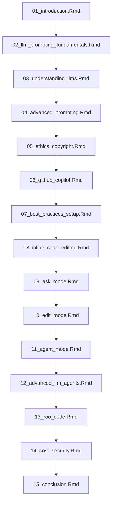

# Chapter Plan for "Quality R analysis with large language models"

This document outlines the chapter structure for the book based on the outline in index.md.

## Chapter Structure

## Detailed Chapter Content

### 01_introduction.Rmd
**Title:** Introduction to LLMs for R
**Time:** 9-10am
**Content:**
- Overview of how LLMs work
- Best practices for prompt engineering
- Software options for R users
- Applications for R users
- Ethics considerations

### 02_llm_prompting_fundamentals.Rmd
**Title:** Part 1: LLM prompting fundamentals
**Time:** 10-10:30am
**Content:**
- Start of practical material
- LLM prompting theory through practical examples
- Deep understanding of how chatbots work
- Advanced prompting skills
- Software requirements: VScode with R or Rstudio, ellmer package, API license

### 03_understanding_llms.Rmd
**Title:** Understanding how LLMs work
**Time:** 10:45-11:30am
**Content:**
- Introduction to LLM technology
- Token input and output
- System and user messages
- Temperature settings
- Model choice and selection
- Creating a specialized stats chatbot with R

### 04_advanced_prompting.Rmd
**Title:** Advanced prompting
**Content:**
- Continuing with the specialized statistics chatbot
- Advanced prompting skills
- Structured data
- Parsing techniques
- Tool construction

### 05_ethics_copyright.Rmd
**Title:** Ethics and copyright
**Content:**
- Discussion of ethical considerations
- Model biases
- Energy use
- Copyright issues
- Managing data privacy

### 06_github_copilot.Rmd
**Title:** Part 2: Github copilot for R
**Time:** 11:30-12:00pm
**Content:**
- Effective use of github copilot for planning, coding, and writing up data analysis
- Software requirements: VScode with R and github copilot license + extension

### 07_best_practices_setup.Rmd
**Title:** Best practices project setup
**Content:**
- Organization to maximize LLM effectiveness
- Version control

### 08_inline_code_editing.Rmd
**Title:** Inline code editing
**Content:**
- Techniques for inline code editing with Github Copilot

### 09_ask_mode.Rmd
**Title:** Planning your project with Ask mode
**Content:**
- Using Ask mode for project planning

### 10_edit_mode.Rmd
**Title:** Creating your code with Edit mode
**Content:**
- Using Edit mode to create code

### 11_agent_mode.Rmd
**Title:** Automated workflows with Agent mode
**Content:**
- Using Agent mode for automated workflows

### 12_advanced_llm_agents.Rmd
**Title:** Part 3: Advanced LLM agents
**Time:** 3:00-3:30pm
**Content:**
- Software requirements: VScode with R, Roo code, API license

### 13_roo_code.Rmd
**Title:** Roo code
**Content:**
- Fully automated workflows with Roo code

### 14_cost_security.Rmd
**Title:** Cost and security
**Content:**
- Cost considerations for LLM usage
- Security implications and best practices

### 15_conclusion.Rmd
**Title:** Conclusion
**Time:** 3:30pm-4:00pm
**Content:**
- Group discussion on what LLMs mean for scientific practice
- Creating community standards

## Implementation Plan

1. Create new chapter files with the appropriate numbering
2. Update existing files to match the new structure
3. Ensure all content aligns with the outline in index.md
4. Update _bookdown.yml if necessary to reflect the new chapter structure

This plan will be implemented by switching to Code mode, which can edit .Rmd files.