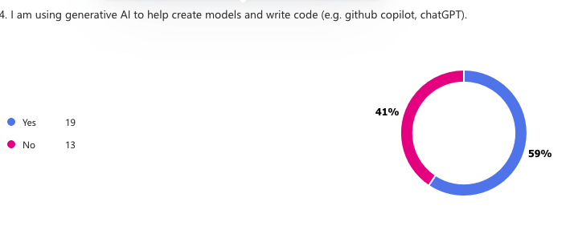
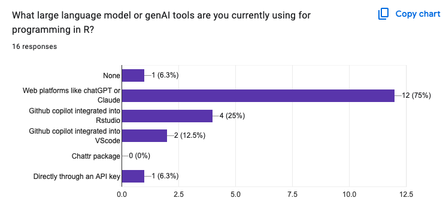

## 

## gen AI: an overview for applications in ecology and environmental sciences

</br>
</br>
</br>

### A/Prof CJ Brown 

Institute for Marine and Antarctic Studies, University of Tasmania

## Overview

- Background on LLMs 
- Overview of LLM capabilities
- Different LLM software 
- Prompt engineering
- Tools and MCP 
- What you should do 
- Future of science with LLMs
- Discussion


## genAI what is it? 

- Artificial intelligence that can generate new content, such as text, images, or code.
- We'll focus on Large Language Models 
- They now excel at generating code
- They can also interpret images, use your web browser, run and debug code
- Predicted to be fully capable software developers in the next 1-3 years

## How LLMs work

- Complex neural network with multiple different types of layers
- Trained on a large corpus of text data
- Can generate new content by predicting the next token (effectively word)

## LLMs do text completion

- If you start writing text the LLM literally predicts the next token. 
- It can roll on from there (show copilot inline example)
- Conversation based LLMs are specifically tuned to respond to queries
- Effectively, they are completing the prompt by predicting the answer (show copilot)

## LLMs jargon

**Token** a part of a word that is the unit of prediction. 
e.g. GPT3.0 had ~50,000 tokens

**Prompt** a piece of text that is used to generate content from an LLM.

**Prompt engineering** the process of designing and refining prompts to get the desired output from an LLM.

**Context window** the number of tokens that the LLM uses to predict the next token. The LLM's 'memory' size. 

**Temperature** Low temperature means the LLM favours the highest probability token, high temperature means its more random

## What types of tasks can LLMs currently do? 

- Answer questions
- Generate text
- Generate code
- Edit code
- Debug code
- Interpret images
- Use your web browser
- Use tools 

## LLM abilities examples 

CB to show a code example with copilot

Cline image interpretation example - images/pca_site_id_scatter.png
(note web browser use)

## Michael share restoration example 

...

## LLM tool use

Tools give LLMs the ability to walk the talk
Examples:

- Access the browser  
- Download data  
- Search the web  
- Use the command line = create files, read files, edit files...  
- Run code, report to itself on results and then correct errors  
- Anything else you can dream up software to do...   

## LLM software options 
| Software Option                  | Pros                                                                                                                                                                                                 | Cons                                                                                                      |
|----------------------------------|-----------------------------------------------------------------------------------------------------------------------------------------------------------------------------------------------------|-----------------------------------------------------------------------------------------------------------|
| Copilot, chatGPT web interfaces  | <small>easy to use, no coding required, often free (or uni subscription)</small>                                                                                                          | <small>Limited control of system message (on some versions), limited customization, cut and pasting required</small>              |
| Github copilot in Rstudio        | <small>easy to use, use the IDE you probably already know, auto-complete code, ask for help, can choose from different LLMs and providers</small>                                                   | <small>no control of system message, limited customization, slow to keep up with new genAI features, monthly subscription fee*</small> |
| Github copilot in VS code | <small>easy to use, autocomplete code, code editing, discussion, code indexing, constantly updated with new features, can choose from different LLMs and providers, generally better than same API in Rstudio</small> | <small>no control of system message, limited customization, monthly subscription fee</small>              |
| Cline                            | <small>Computer use, image reading capability, fully automated workflow (writes code then tests it), choice of provider (can even switch halfway), can customize system message, excels at programming.</small> | <small>API costs can rack up, can't fully customize the system which includes a lot of stuff that is useless for an R programmer</small> |
| Windsurf and Cursor              | <small>like Cline but fixed fee per 500 prompts. So can be cheaper</small>                                                                                                                           | <small>Can't fully customize the system message</small>                                                   |
| DIY API calls                    | <small>You control everything</small>                                                                                                                                                                | <small>You have to do a lot of work to set it up. Doesn't have level of software development of Cline etc...</small> |

## Are marine scientists using these tools?



## Are marine scientists using these tools?



## 3.5 ways to get more out of your LLM

- Finetuning
- RAG (retrieval augmented generation)
- MCP (protocol for prompting and tool use)* 
- **Prompting better**

## Prompt engineering

A few more terms: 

- API - Application Programming Interface
- system message
- user message
- assistant message

## Prompt engineering

- System message controls the context for all follow up prompts. 
- It is meant to override the user message and assistant message.
- For many models it is the most influential prompt

Example from [Fabric](https://github.com/danielmiessler/fabric/tree/main/patterns) 

```
# IDENTITY and PURPOSE:
You are a research paper analysis service focused on determining 
the primary findings of the paper and analyzing its scientific 
rigor and quality.

Take a deep breath and think step by step about how to best 
accomplish this goal using the following steps.

## STEPS

- Consume the entire paper and think deeply about it.

- Map out all the claims and implications on a 
virtual whiteboard in your mind....
```

## Prompt engineering

- User message is the prompt that the user writes. 
- It usually includes task specific stuff 
- e.g. the system includes the rules for analysing a paper
- the user would include the paper to be analysed

## Prompt engineering tips 

(from [Anthropic](https://docs.anthropic.com/en/docs/build-with-claude/prompt-engineering/overview))

- Be clear and direct
- Use examples (multishot)
- Let Claude think (chain of thought)
- Use XML tags
- Give Claude a role (system prompts)
- Prefill Claude’s response (API only)
- Chain complex prompts

## Prompt ideas

The fabric software is a software for prompt templates. It is open source, so you can 
get [inspired with prompts from their repo](https://github.com/danielmiessler/fabric/tree/main/patterns).

## Evaluating prompt engineering success

- Most of us do this informally
- But you can also do it formally
- Define clear success criteria
- Try different prompts
- Compare prompts against your success criteria (much like marking undergraduates)

## Tools and MCP 

More examples with Cline. 
See /benthic-cover-example

## MCP, how it doesn't work


From posit


## MCP, how it does work


From posit

## My MCP example 1

Made an R function

```
    mytool <- tool(
      get_sst,
      "Gets SST data from the IMOS BlueLink database",
      data_path = type_string(
        "Path to a csv dataframe that has columns datetime, X, Y",
        required = TRUE
      ),
      depth = type_number(
        "The depth to extract the SST data from",
        required = TRUE
      )
    )
```

## My MCP example 2

Made a tool

```
#' Extracts SST data from the IMOS BlueLink database
#'
#' @param data_path A path to a csv dataframe
#' @param depth The depth to extract the SST data from
#' @return The current time in the given time zone.
get_sst <- function(data_path, depth) {
  dat <- read.csv(data_path)
  datout <- extractBlue(df = dat,
                X = "X", 
                Y = "Y", 
                datetime = "datetime", 
                env_var = "BRAN_temp",
                extract_depth = depth,
                verbose = FALSE,
                full_timeperiod = FALSE)
  write.csv(datout, "temp_data.csv", row.names = FALSE)
  return("File written to sst_data.csv")
}
```

## My MCP example 3

Asked the model to use the tool (note you don't have to know the specific tool name)

```    
chat$chat("Can you get me SST data at 21m depth for the coordinates in tas_dat.csv?")
```

## What you should learn right now

- Play around with prompt strategies
- Document what you do, save your prompts, they are valuable IP
- Learn more programming tools
- I recommend VScode
- Start using Github

## What this means for science

Discussion...

- What if we didn't have to write code anymore?
- What if LLMs could write entire papers from analysis to submission? 
- Will it accelerate science for good or concentrate power? 
- What if science isn't done by scientists anymore? 
- New costs to absorb for research budgets

## On to the tutorial

[Tute here](https://www.seascapemodels.org/rstats/2025/03/15/LMs-in-R-with-ellmer.html)

[Also see the tool use tute](https://www.seascapemodels.org/rstats/2025/03/17/LLMs-in-R-tool-use.html)

You'll need:

- R  
- R IDE (Rstudio or VS code)  
- ellmer  
- usethis  
- shinychat  
- API key for Anthropic  
  